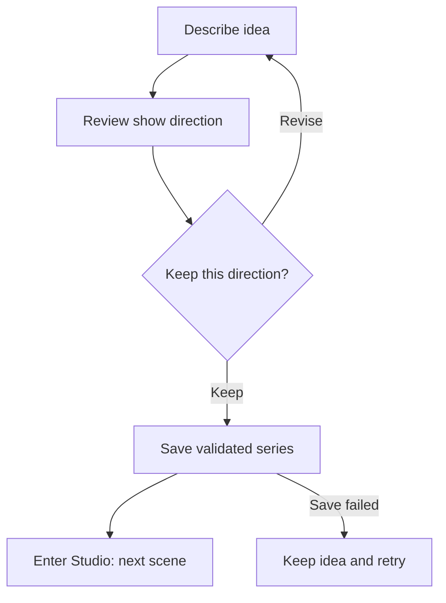
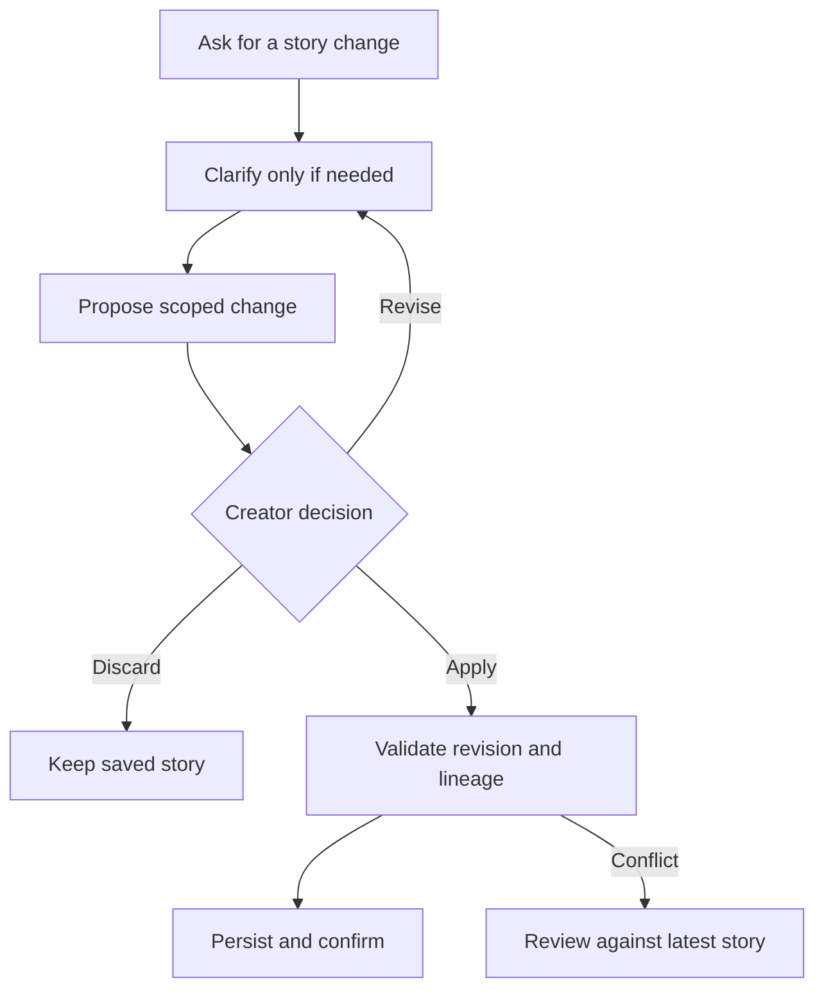
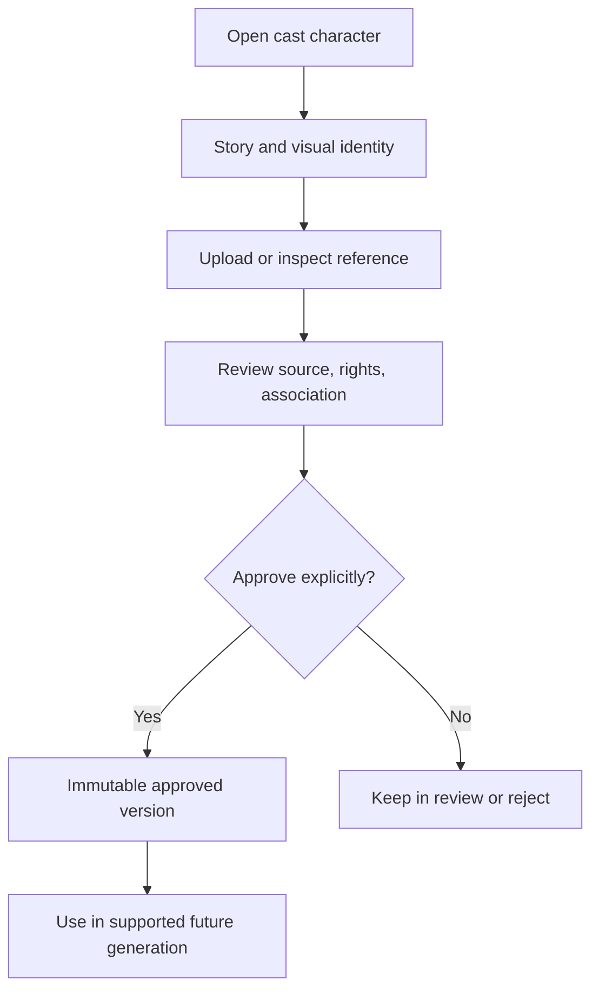

# Creator Studio: UX flows and reusable elements

Status: implementation proposal. The interactive conversation preview uses illustrative fixtures and local interactions. It does not save, generate media, approve references, or export an episode.

## Product direction

Guide the creator through one useful decision at a time. Keep their show, cast, and episode accessible from any step. State what an action will produce before the creator invokes it. Confirm a save or job only after the server confirms it.

Use the existing Studio's violet accents, calm surfaces, and mobile navigation. Avoid reproducing Mochi's credit economy or turning the production pipeline into an endless chat transcript. Conversation is an input method; the episode board is the durable overview.

## Delivery order and capability boundaries

| Flow | Priority | Existing foundation | Dependency before full implementation |
| --- | --- | --- | --- |
| Guided start | Next | Show Genesis, SeriesBlueprint, series persistence | Verify actual creation route and transactional save UX; bounded errors and pending behavior |
| Episode board | Next | Scene summaries, EpisodeHero, beat list, scene workspace, guide in PR #21 | None for planning-only board; downstream status needs additional scoped reads |
| Character continuity | Next | CastStrip, CastDetailSheet, production reference workspace | Character-specific reference query and verified association; canonical editing is separate |
| Story conversation | After decisions contract | Validated blueprint and production lineage | Persisted conversation plus validated revision-aware proposals and save/apply contract |
| Production activity | After status read model | Existing durable production jobs and stage-specific workspaces | Creator-scoped aggregate read model; provider capability status; polling lifecycle |
| Review and export | Last | Episode assembly and final-export architecture | Verify operational preview/export capability and persisted assets; do not infer it from architecture |

Repository inspection established that `updateSeriesRecord` currently updates title and status only. It does not support editing SeriesBlueprint. `ClarificationCard`'s optional answer callback is not wired by the series page. Conversation and clarification must not imply durable canonical editing until that boundary exists.

## Flow A: Guided start

**Intent:** turn a loose idea into a show without front-loading configuration.

- First screen: one textarea, short example, one primary action: **Explore this show**.
- Keep optional episode settings collapsed; use supported limits from the schema rather than inventing them.
- Review screen: working title, premise, protagonist want, central tension, and Episode 1 hook. Avoid an encyclopedia.
- Distinguish reviewing generated direction from saving it. Do not lose the idea on provider/save failure.
- Clarification asks a relevant question with applicable answer choices. Never render arbitrary yes/no buttons for an open question.
- Successful persisted series transitions to its real Studio URL. Refresh must return the saved series, not regenerate it.

**Elements:** IdeaComposer, DirectionReview, StoryDecisionCard, SaveStatus, NextStepCard.

**Acceptance:** keyboard submit; visible pending state; validated input bounds; provider failure preserves text; failed save never claims success; two clicks do not create two series through the supported creation contract.

## Flow B: Story conversation with reviewed edits

**Intent:** "Make Orin's healing more unsettling" becomes an inspectable story change.

- Context header: current series, selected character/scene, and a route back to the board.
- Composer suggests meaningful actions, not generic prompts: **Strengthen the conflict**, **Develop this character**, **Review continuity**.
- Separate advice from changes. Advice can be displayed without implying anything was saved.
- ProposedChangeCard shows current/proposed values, affected characters/scenes, and existing outputs that may need review.
- Preserve older production lineage. Never silently relabel old frames as generated from new canon.
- Apply validates ownership, proposal bounds, schema invariants, and expected revision. Conflicts require a fresh review.
- Show **Saved to story** only after a confirmed commit. **Proposal ready** is a different state.

**Elements:** ContextHeader, ScopedComposer, SuggestionChips, ProposedChangeCard, AffectedWorkList, SaveReceipt.

**Acceptance:** rejected change preserves current canon; cross-owner requests denied; stale revision does not overwrite newer work; refresh restores accepted edits and conversation; prompt injection cannot bypass validation.

## Flow C: Character continuity and reference review

**Intent:** creators know which design is approved and used for future production.

- Header: portrait when available, name, story role, and accurate linked-series context. Use an honest placeholder when no portrait exists.
- Sections: Who they are; Appearance; Movement and abilities; Visual references; Used in this series.
- Reference gallery groups identity, costume, pose, expression, and ability reference roles. A turnaround sheet is not a substitute for a required primary identity reference.
- Zoom opens an accessible dialog with close, Escape, and restored focus. Never load another creator's private image.
- Approval surfaces provenance and required production/conditioning permissions before submission.
- **Approve reference** is independent from **Generate reference**. Keep candidate and approved versions distinct.
- Replacements create new versions. Approved historical assets remain immutable.
- No public-sharing toggle until a supported sharing feature exists.

**Elements:** CharacterHeader, IdentitySummary, ReferenceGallery, ReferenceRoleBadge, ReferenceReviewSheet, VersionHistory.

**Acceptance:** missing artwork state; pending approval; rejected reference; immutable replacement; creator-scoped signed access; narrow viewport zoom; unsupported conditioning remains visibly unavailable.

## Flow D: Episode board and focused scene workspace

**Intent:** show the episode's structure without requiring creators to read a chat history.

- Entry: Studio → Episode → scene card → existing scene workspace → next valid production step.
- Board lists story beats in canonical order, with scene title, story change, actual scene-plan state, and one contextual action.
- For this first slice, label progress **Scene plans**, not production or render completion.
- Scene card states: **Not planned**, **Draft plan**, **Ready plan**, **Archived** only in a separate history view.
- NextStepCard recommends the earliest missing or draft scene using the semantics established in PR #21.
- Scene detail leads with intent and emotional turn. Put technical production details behind stage-specific views.
- Read-only **Your series** drawer provides cast, locations, and style, retaining the existing mobile navigation.
- Selecting a scene opens its real workspace. A missing scene requests a plan only through the existing canonical endpoint.
- Manual planning reordering is outside this task unless a validated rewrite contract exists. Do not ship decorative drag handles.

**Elements:** EpisodeContextHeader, ScenePlanCard, StageBadge, NextStepCard, SeriesDrawer, SceneContextPanel.

**Acceptance:** blueprint order; active/current-beat deduplication; explicit archived behavior; real routing; no overflow at 320px; dialog focus/scroll handling; no rendered-media claims based on scene plans.

## Flow E: Production activity and recovery

**Intent:** creators can continue writing while supported durable media jobs run.

- Entry: contextual generation action → verify prerequisites → accepted job → continue writing → inspect job/output.
- Status labels come from server state: **Queued**, **Running**, **Ready to review**, **Needs attention**.
- Do not display fictional percentages, queue position, completion times, or costs. Use configured and verified values when available.
- Job card identifies series, scene, stage, submitted revision, and output association. A result generated against an old revision requires explicit context.
- Retry is available only through an existing allowed retry path. It must respect idempotency, leases, ownership, and provider failure behavior.
- **Cancel** is absent unless server-side cancellation semantics exist. Closing the UI does not cancel a job.
- Include genuine capability blockers: missing approved reference, unsupported conditioning, unconfigured provider, or worker not operational.
- Poll while visible, stop on terminal state, back off on transient errors, and avoid exposing worker tokens or provider logs.

**Elements:** PrerequisiteCard, JobStatusCard, ActivityBadge, RetryAction, StaleOutputNotice, OutputReviewLink.

**Acceptance:** queued/running/terminal states; poll cleanup; expired auth; failed retry; duplicate submissions; stale outputs; unavailable provider; navigation does not imply cancellation.

## Flow F: Episode review and export

**Intent:** review the actual assembled result and understand what blocks delivery.

- Entry: existing assembly → real preview when available → check missing/stale media → resolve blockers → supported export job → real download.
- Preview may be partial but must be labeled **Partial preview** and identify missing scenes/media.
- Readiness is derived from saved lineage and actual assets, never a fabricated percentage or a count of scene plans.
- Show exact blockers: missing clip, failed dialogue line, missing audio asset, stale assembly, or unsupported export runtime.
- **Export episode** remains unavailable until an operational supported contract exists and readiness passes.
- If the current implementation is architecture only, render an explanatory state instead of a working-looking export button.
- Formats and presets must correspond to supported runtime capabilities. Anime/manga medium selection is a separate production capability; do not imply manga export exists.

**Elements:** AssemblyPreview, ReadinessChecklist, BlockingIssueRow, VersionContext, ExportOptions, ExportJobCard, DownloadReceipt.

**Acceptance:** no phantom playback; unsupported exporter state; missing/stale media; cross-owner access denied; correct lineage; real downloadable output; refresh retains job status.

## Shared element contracts

| Element | Minimum inputs | Required behavior |
| --- | --- | --- |
| ContextHeader | series title, current context, real links | Stable orientation; no fake cast thumbnails |
| NextStepCard | scoped saved state, recommendation | One primary action, reason, alternative navigation |
| StoryDecisionCard | question kind, options, real save capability | Pending/saved/error; no inert answer controls |
| ProposedChangeCard | revision, current/proposed fields, affected work | Review, revise, discard, validated apply |
| StageBadge | explicit stage + state | Label stage so "ready plan" cannot mean "ready episode" |
| ScenePlanCard | beat order, story change, active scene | One contextual action; archive/history distinction |
| ReferenceReviewSheet | ownership, source, roles, rights, approval state | Explicit approval; focus trap; immutable version context |
| JobStatusCard | durable job ID/state, real output association | Accurate state and permitted recovery action |
| ReadinessChecklist | verified asset/lineage blockers | Direct links to fix supported blockers |
| SaveReceipt | confirmed persistence result and revision | Success only after durable confirmation |
| SeriesDrawer | canonical cast/location/style summaries | Accessible dialog; context preserved on return |
| CapabilityNotice | actionable unsupported/missing prerequisite | Plain explanation; supported next step when possible |

## Responsive and interaction rules

- Mobile first at 320px, 390px, and 430px; verify desktop at 1280px and 1440px.
- One main action per decision. Keep **Revise**, **Discard**, and **Choose another** available as secondary actions.
- Use 44px minimum effective touch targets, readable 16px editable text, keyboard access, visible focus, and reduced-motion support.
- Drawers become contextual side panels on desktop where useful. Native scroll, safe-area spacing, and keyboard/composer overlap must be tested.
- Never let decorative progress imply completion. Count planning separately from accepted references, rendered media, and assembled/exported episodes.
- Saved, unsaved, proposed, queued, and completed are distinct states.
- Mockups are design fixtures. Production screens must bind to real ownership-scoped data.

## [SELF-PROMPT] A: Guided-start integration

Act as a principal creator-onboarding designer and senior Next.js engineer. Inspect current main, open PRs, CI, instructions, creation UI, Show Genesis endpoint, validated response contracts, and series persistence. Implement one isolated guided-start flow: idea input, bounded optional settings, concise direction review, confirmed save, then the actual series URL. Preserve the user's text on failures. Reuse existing contracts, distinguish generation from persistence, and avoid creating unsupported story-edit endpoints. Keep decision inputs informational unless persistence exists. Test invalid input, provider/save failure, duplicate submit, real routing, refresh recovery, and mobile keyboard behavior. Open a bounded PR without merging. Report capability limits and the next dependency with a new self-prompt.

## [SELF-PROMPT] B: Canonical story-decision contract

Act as a principal story-data architect and Supabase/Next.js engineer. Inspect SeriesBlueprint invariants, updateSeriesRecord, clarification UI, production lineage, RLS, and revision semantics. Perform one isolated task: define and implement a creator-owned, revision-aware validated decision/proposal boundary needed before conversational editing. Do not treat the title/status update handler as a blueprint-write API. Decide how accepted decisions affect canonical data and how old production versions remain valid. Require explicit creator apply, reject stale revisions and invalid references, and acknowledge saved state only after persistence. If this cannot fit a bounded contract, remove misleading interactive clarification behavior and document the dependency. Test ownership, conflicts, reload persistence, rejected proposals, retries, and lineage. Open a PR without merging. End with a self-prompt for a conversation UI consuming this contract.

## [SELF-PROMPT] C: Character continuity UI

Act as a principal character-production UX designer and senior React engineer. Inspect cast details, character performance bible, production reference roles, private access, approval endpoints, and versioning. Implement a character-focused continuity view using existing records: biography, appearance, performance/abilities, associated reference gallery, zoom, and explicit review navigation. Preserve approval/rights checks and immutable versions. Reuse existing approval workspace where a scoped action is sufficient. Do not add public sharing or fake artwork. Test missing/rejected/approved references, association mismatches, ownership, focus and zoom, and mobile layout. No GPU calls. Open a bounded PR without merging. End with the next self-prompt.

## [SELF-PROMPT] D: Episode board and series drawer

Act as a principal mobile Studio designer and senior Next.js engineer. Inspect current main and PR #21 before implementing. Build one isolated planning-only episode board and accessible read-only series drawer using existing scene summaries and canonical cast/location/style. Reuse guided next-step semantics, preserve beat order, route saved scenes to their actual workspaces, and use the existing scene endpoint for missing plans. Exclude archived/unknown scenes from planning counts. Label state by stage. Do not add reordering, montage preview, or downstream readiness without verified contracts. Test active-scene selection, recommendation, routing, requests, focus restoration, keyboard/scroll handling, and 320px through desktop layouts. Open a PR without merging. End with the next self-prompt.

## [SELF-PROMPT] E: Production activity read model

Act as a principal production-workflow UX architect and durable-job engineer. Inspect creator-scoped status/read/retry contracts for all candidate stages and their actual provider support. Implement one bounded activity view for the smallest defensible existing job family, not all job types at once. Use genuine durable states and association metadata. Preserve ownership, idempotency, lease semantics, and sanitized errors. Poll only while needed, stop terminal polling, and handle expired auth. Show capability blockers without exposing internal credentials. No synthetic ETA, percentages, prices, or cancellation. Test lifecycle and retry behavior. Do not invoke paid generation for UI validation. Open a PR without merging and self-prompt the next supported job family.

## [SELF-PROMPT] F: Honest assembly review

Act as a principal episode-review UX designer and media-pipeline engineer. Inspect assembly lineage, actual preview playback, final-export architecture, operational exporter availability, and private asset access. Implement one isolated review surface with real preview if supported and a verified blocker checklist. Explicitly label partial assemblies and stale versions. Provide real links to fix supported blockers. Keep export informational if the runtime is not operational; never fabricate playback or downloads. Preserve ownership and historical versions. Test missing/stale assets, partial preview, unsupported export, access boundaries, keyboard navigation, and responsive layout. Open a bounded PR without merging. End with a self-prompt for the next missing export dependency.
